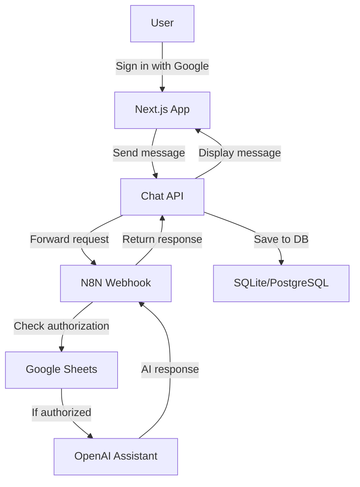

# BasicChatUI

A complete, AI chatbot system with secure user authentication, N8N workflow automation, and OpenAI Assistant integration. This project provides a modern chat interface, automated user authorization through Google Sheets, and seamless AI conversation management with persistent chat history.

## 🎯 Complete Solution Overview

This project combines multiple components to create a secure, scalable AI chatbot system:

- **🖥️ Next.js Chat Interface** - Modern, responsive web application with authentication
- **🔐 Google OAuth Integration** - Secure user authentication with Google accounts  
- **🤖 N8N Workflow Automation** - Automated user authorization and AI message routing
- **📊 Google Sheets User Management** - Simple spreadsheet-based user authorization system
- **🧠 OpenAI Assistant Integration** - Advanced AI responses with file search capabilities
- **💾 Database Persistence** - All conversations saved with user association

## 📁 Project Structure & Documentation

This repository includes comprehensive setup guides for the entire system:

```
BasicChatUI/
├── 📱 Next.js Application Code
│   ├── app/                     # Main application
│   ├── lib/                     # Utilities and configuration
│   ├── prisma/                  # Database schema and SQLite DB
│   └── .env.local.example       # Environment variables template
│
├── 📚 Complete Setup Documentation
│   ├── INSTRUCTIONS/
│   │   ├── 🌐 google-cloud-setup.md           # Google OAuth setup guide
│   │   ├── 🤖 openai-assistant-setup.md       # OpenAI Assistant creation
│   │   ├── ⚙️ n8n-chatbot-workflow-setup.md   # N8N workflow configuration
│   │   └── N8N-WORKFLOW/
│   │       └── ChatBot.json                    # Ready-to-import N8N workflow
│   ├── 🧠 CLAUDE.md                            # AI context for development
│   └── 📖 README.md                            # This comprehensive guide
```

## 🚀 Getting Started

**Follow these guides in order:**

1. **[Google Cloud Setup](./INSTRUCTIONS/google-cloud-setup.md)** *(15-20 mins)*
   - Create Google Cloud project
   - Enable Google+ API  
   - Generate OAuth credentials
   - Configure environment variables

2. **[OpenAI Assistant Setup](./INSTRUCTIONS/openai-assistant-setup.md)** *(30-45 mins)*
   - Create OpenAI account and get API key
   - Build AI Assistant with vector store
   - Upload knowledge base documents
   - Test assistant functionality

3. **[N8N Workflow Setup](./INSTRUCTIONS/n8n-chatbot-workflow-setup.md)** *(60-90 mins)*
   - Set up N8N account
   - Configure Google Sheets for user authorization
   - Import and configure the ChatBot workflow
   - Connect OpenAI Assistant
   - Test end-to-end functionality

## 🏗️ System Architecture



### How the Complete System Works

1. **🔐 User Authentication**: Users sign in with Google OAuth through NextAuth.js
2. **💬 Chat Interface**: Modern, responsive chat UI with real-time message updates
3. **📤 Message Routing**: Chat messages sent to N8N webhook with user email
4. **✅ Authorization Check**: N8N checks user's email against Google Sheets allowlist
5. **🤖 AI Processing**: Authorized messages forwarded to OpenAI Assistant
6. **🧠 Smart Responses**: Assistant uses vector store knowledge base for accurate answers
7. **💾 Persistence**: All conversations saved to database with user association
8. **🔒 Security**: Unauthorized users receive denial message

## ⚙️ Configuration Files

### Environment Variables (`.env.local`)
```env
# NextAuth Configuration
NEXTAUTH_URL=http://localhost:3000
NEXTAUTH_SECRET=your-secret-key-here

# Database
DATABASE_URL="file:./dev.db"

# Google OAuth (from Google Cloud setup)
GOOGLE_CLIENT_ID=your-google-client-id
GOOGLE_CLIENT_SECRET=your-google-client-secret

# N8N Webhook (from N8N workflow setup)
N8N_WEBHOOK_URL=your-n8n-webhook-url
```

### Google Sheets User Authorization
Create a Google Sheet with this structure:
```
A           | B
Email       | Name
john@co.com | John Smith
jane@co.com | Jane Doe
```

### N8N Workflow (`INSTRUCTIONS/N8N-WORKFLOW/ChatBot.json`)
Ready-to-import workflow that handles:
- User authorization via Google Sheets lookup
- OpenAI Assistant message routing
- Conversation memory management
- Error handling and response formatting

## 🛠️ Development Workflow

### Local Development
```bash
# Start development server
npm run dev

# Run database migrations
npm run db:push
npm run db:generate

# Code quality checks
npm run lint
npm run build
```

### Adding New Users
1. Open your Google Sheets authorization list
2. Add user's email to the "Email" column
3. User can immediately access the chatbot

### Updating AI Knowledge Base
1. Log into OpenAI platform
2. Go to your Assistant's vector store
3. Upload new documents
4. Changes take effect immediately

### Monitoring and Debugging
- **N8N Executions**: View workflow runs and debug issues
- **OpenAI Usage**: Monitor API usage and costs
- **Database**: Check `prisma/dev.db` for stored conversations
- **Application Logs**: Check browser console and server logs

## 🔧 Customization Options

### Chat Interface Styling
- Modify `app/page.tsx` for UI changes
- Update `styles/globals.css` for custom themes
- Configure `tailwind.config.ts` for design system changes

### Authentication Providers
- Add additional OAuth providers in `lib/auth.ts`
- Configure provider-specific environment variables
- Update sign-in page styling in `app/auth/signin/page.tsx`

### AI Assistant Behavior
- Update assistant instructions in OpenAI platform
- Add/remove documents from vector store
- Modify N8N workflow message formatting

### Database Schema
- Edit `prisma/schema.prisma` for data model changes
- Run `npm run db:push` to apply changes
- Use `npm run db:generate` to update Prisma client

## 🚨 Troubleshooting

### Common Issues

**Authentication Problems**:
- Verify Google Cloud OAuth setup
- Check redirect URIs match exactly
- Ensure APIs are enabled in Google Cloud Console

**N8N Workflow Failures**:
- Check Google Sheets permissions
- Verify OpenAI API key and credits
- Review N8N execution logs for errors

**Database Issues**:
- Run `npm run db:push` to sync schema
- Check SQLite file permissions
- Verify DATABASE_URL in environment

**AI Assistant Not Responding**:
- Confirm OpenAI Assistant exists and is configured
- Check vector store has processed documents
- Verify N8N can access OpenAI API

### Getting Help
- Review detailed setup guides in `INSTRUCTIONS/` folder
- Check N8N community forums for workflow issues
- Consult OpenAI documentation for assistant problems
- Use browser developer tools for frontend debugging

## 🌟 Advanced Features

### Conversation Memory
Each user maintains separate conversation history using their email as a session key. The N8N workflow automatically manages context across multiple messages.

### File Search Capabilities
The OpenAI Assistant can search through uploaded documents to provide accurate, contextual responses based on your knowledge base.

### Scalable User Management
Google Sheets provides an easy way to manage user access without complex admin interfaces. Simply add/remove emails to control access.

---

## 📚 Technical Reference

### Tech Stack Details
- **Frontend**: Next.js 14, React 18, TypeScript
- **Styling**: Tailwind CSS with custom design system
- **Authentication**: NextAuth.js with Prisma adapter
- **Database**: Prisma ORM with SQLite (dev) / PostgreSQL (prod)
- **API Integration**: Next.js API routes with N8N webhook
- **AI Platform**: OpenAI Assistants API with vector stores
- **Workflow Automation**: N8N cloud/self-hosted
- **User Management**: Google Sheets integration
- **Development**: ESLint, TypeScript, Hot reload

### UI Features
- **Glass morphism design** with backdrop blur effects
- **Smooth animations** for message sending and loading states
- **Responsive layout** that adapts to screen sizes
- **Accessibility** features with proper ARIA labels
- **Dark mode ready** design system
- **Auto-scrolling** chat area with smooth behavior

### API Endpoints
- `/api/auth/[...nextauth]` - NextAuth.js authentication endpoints
- `/api/chat` - Main chat endpoint that forwards to N8N webhook

### Webhook Integration Details
The `/api/chat` endpoint sends requests to N8N in this format:
```json
{
  "message": "user message content",
  "userEmail": "user@example.com"
}
```

Expected N8N response format:
```json
{
  "output": "assistant response text"
}
```

### Database Schema
Key models in `prisma/schema.prisma`:
- **User**: Stores user account information
- **Account**: OAuth account linkage
- **Session**: User session management
- **ChatMessage**: All conversation history

### Security Features
- OAuth2 authentication via Google
- User authorization via Google Sheets allowlist
- Session-based access control
- Input validation and sanitization
- Rate limiting through N8N workflow
- Secure environment variable management

### Contributing Guidelines
1. Fork the repository
2. Create a feature branch (`git checkout -b feature/amazing-feature`)
3. Make your changes
4. Run `npm run lint` to check code quality
5. Test with both local and N8N integration
6. Submit a pull request

### License & Support
- **License**: Apache 2.0 License (see LICENSE file)
- **Issues**: Use GitHub Issues for bug reports and feature requests
- **Documentation**: Comprehensive guides in `INSTRUCTIONS/` folder